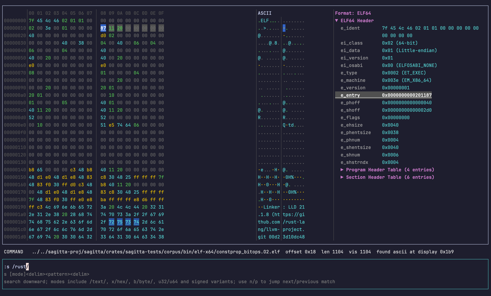
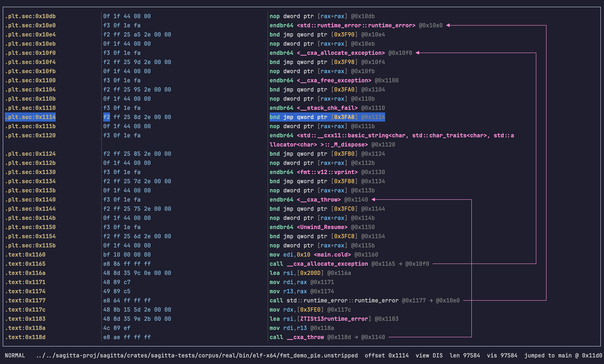
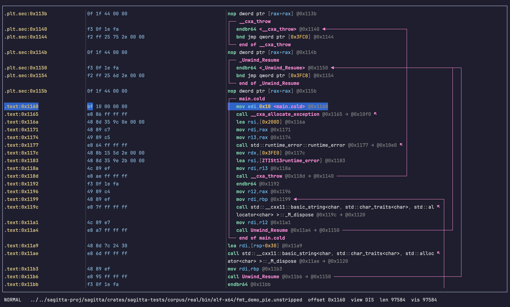
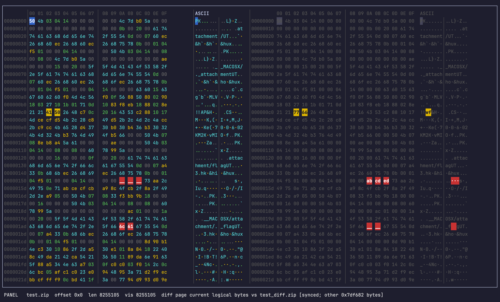

# hxedit

A fast terminal hex editor built for large binary files.

[中文文档 / Chinese README](README_CN.md)

`hxedit` lets you open, navigate, edit, search, diff, hash, and export binary
data without leaving the terminal. It reads files through a paged cache so
gigabyte-scale files open quickly, and it keeps every byte edit explicit so
undo, save, and search stay predictable.



*The paged hex/ASCII view with a movable cursor, a format-aware inspector side
panel, and the command line and current mode along the bottom.*

## Install

Install the latest release from crates.io:

```bash
cargo install hxedit
```

Or download a prebuilt binary from the
[releases page](https://github.com/ycsgg/hxedit/releases), extract it, and put
`hxedit` on your `PATH`.

Then open a file:

```bash
hxedit some.bin
```

Open read-only at an offset with the inspector visible:

```bash
hxedit --readonly --offset 0x100 --inspector some.bin
```

Run automation without opening the TUI:

```bash
hxedit some.bin --run patch.hxmacro
hxedit some.bin --script examples/simple_hash_patch.hxscript
hxedit some.bin --command "goto 0x100" --command "fill 90 16" --command "w"
```

## Keys

`hxedit` uses a modal, vim-like scheme. Press `:` to run a command, `Esc` to
return to normal mode.

| Key | Action |
|---|---|
| `h` `j` `k` `l` / arrows | Move cursor; `PageUp`/`PageDown`, `Home`/`End` for rows |
| `i` | Enter insert mode (typed hex shifts following bytes) |
| `r` | Enter overwrite mode (typed hex replaces bytes in place) |
| `x` | Delete the byte (or selection) under the cursor |
| `v` | Start/stop a visual selection |
| `n` / `p` | Jump to next / previous search hit |
| `t` or `Tab` | Toggle the side panel (inspector / memory / etc.) |
| `:` | Open the command line |
| `Esc` | Leave the current mode |
| `Ctrl+Z` / `Ctrl+Y` | Undo / redo while editing |
| `Ctrl+C` | Force quit |

## Commands

| Command | Description |
|---|---|
| `:w` / `:wq` | Save / save and quit |
| `:q` / `:q!` | Quit / discard and quit |
| `:u [n]` / `:redo [n]` | Undo / redo |
| `:g <offset>` / `:g end` | Jump to an offset |
| `:s /text/` / `:s x/de ad be ef/` | Search text or hex bytes |
| `:p` / `:pi` | Paste as overwrite / insert |
| `:c [fmt]` | Copy the active selection |
| `:export <path>` | Export the edited bytes |
| `:hash sha256` | Hash the selection or whole file |
| `:source <path>` | Run a TOML macro file |
| `:script <path>` | Run a Rhai script file |
| `:diff <path>` | Compare against another file |
| `:insp` | Open the format inspector |

For full command syntax, CLI flags, configuration, memory editing, disassembly,
and Sagitta analysis, see the [user guide](docs/user-guide.md).

## What You Can Do

- Open and edit large files with overwrite, insert, and delete
- Search text, hex bytes, single-byte values, or typed integers
- Copy, export, hash, fill, zero, XOR, or replace selected bytes
- Run TOML macro files and Rhai scripts through the same execution layer as manual edits
- Run macro files, Rhai scripts, or compatible commands headlessly from the CLI
- Inspect ELF, PE/COFF, Mach-O, PNG, ZIP, SQLite, PCAP, GZIP, GIF, BMP, WAV,
  TAR, and JPEG structures inline
- Compare against another file in a synchronized read-only diff view
- Optionally edit process memory, browse disassembly, look up symbols, run
  Sagitta analysis, and apply inline assemble patches



*Read-only disassembly with branch jump rails (`:dis`).*



*Sagitta-backed analysis on the current logical bytes (`:ana`).*



*Synchronized read-only diff against another file (`:diff`).*

## Performance

`hxedit` is built for large files. On a 1 GiB file it opens in well under a
millisecond, searches end to end in ~190 ms, and walks a synchronized diff in
~320 ms, all while keeping peak RSS in the single-digit MiB range. Full
scenarios, hardware, and reproduction commands are in
[docs/performance-report.md](docs/performance-report.md).

## Build Variants

| Variant | Command | Use when |
|---|---|---|
| `core` | `cargo build --release --no-default-features` | You want the editor, inspector, search, diff, hash, copy/paste, and export only |
| `default` | `cargo build --release` | You want the normal build with process memory editing, disassembly, symbols, and Rhai scripts |
| `full` | `cargo build --release --no-default-features --features full` | You also want Keystone-backed inline assembly patching and Sagitta analysis |

## Good To Know

Byte edits are explicit: overwrites change bytes in place, inserts shift the
following data, and deletes are non-destructive until you save or export. This
is what keeps undo, save, search, export, hash, diff, and inspector writes
consistent. Format inspectors only write the bytes you edit; they do not repair
checksums, CRCs, or layouts for you. Process memory edits stay local until you
explicitly commit them back to the target process. See
[docs/editing-model.md](docs/editing-model.md) for the exact semantics.

## Documentation

| Document | Use |
|---|---|
| [docs/user-guide.md](docs/user-guide.md) | User-facing build, CLI, config, and command reference |
| [docs/performance-report.md](docs/performance-report.md) | Large-file benchmark scenarios and reproduction commands |
| [docs/architecture.md](docs/architecture.md) | Current product surface, behavior boundaries, and code map |

## License

The `hxedit` source code in this repository is dual-licensed under either MIT or
Apache-2.0, at your option. See [licenses/](licenses/) for the full license
texts and third-party notices.

`full` builds enable optional Keystone-backed inline assembly patching and
Sagitta analysis. Redistributed `full` artifacts must include the third-party
and Keystone notice files described in
[docs/user-guide.md](docs/user-guide.md#redistribution-notes).
